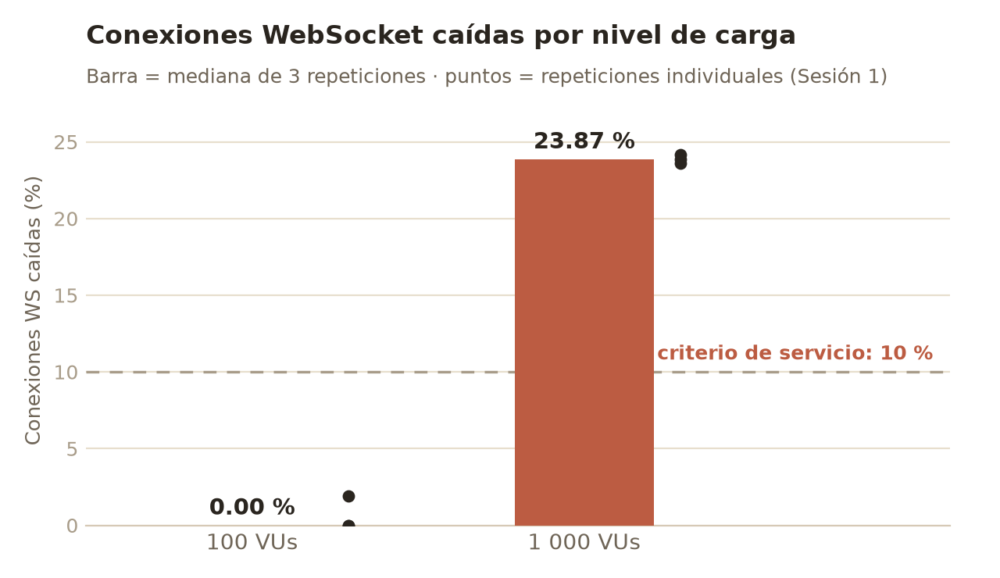
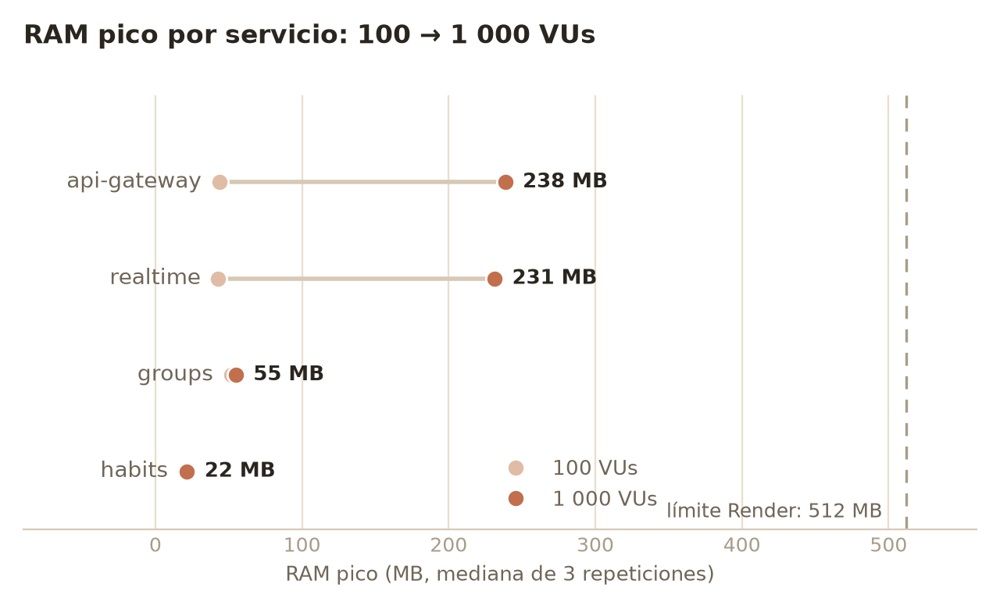
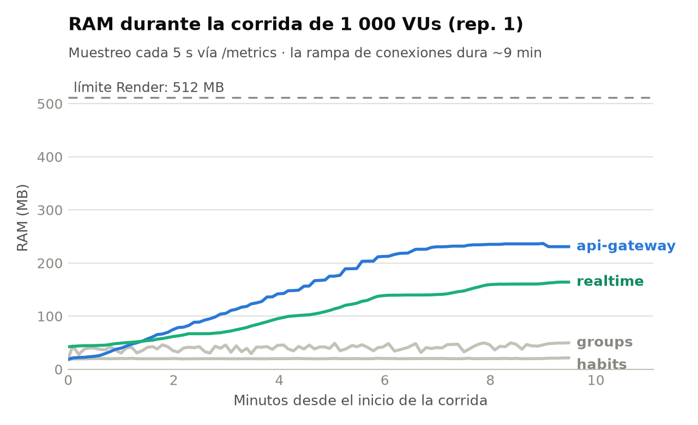

# Evaluación de una arquitectura de microservicios en tiempo real sobre la capa gratuita de Render: un estudio de caso bajo inyección de carga

**Autores:** García Páez David Israel · Solis Flores Irvin Alfonso · Cervantes
Guerrero Keila Yuridia · Casiano Gamzi Juan David
*Universidad Tecnológica de Durango (UTD) · Proyecto Integradora 2026*

---

## Resumen

Las capas gratuitas de plataformas como servicio (PaaS) imponen restricciones
severas de memoria (512 MB), suspensión por inactividad y horas de cómputo
limitadas, por lo que suelen descartarse para sistemas distribuidos en tiempo
real. Este trabajo evalúa empíricamente si una arquitectura de microservicios
(cuatro servicios en Go repartidos en cuatro cuentas independientes de la capa
gratuita de Render, con WebSockets propios para difusión en tiempo real) puede
sostener tráfico concurrente sin morir por agotamiento de memoria (OOM kill) ni
degradar su latencia de forma inaceptable. Mediante experimentación controlada
con k6 (rampas de 100, 1 000, 2 500 y 5 000 usuarios virtuales, tres
repeticiones por nivel; se ejecutaron los niveles de 100 y 1 000 antes de que
las cuotas de la propia plataforma agotaran la ventana experimental) y telemetría embebida de bajo costo (Prometheus + logs
estructurados), se midió la relación entre la carga inyectada y el consumo de
recursos, el percentil 95 de latencia HTTP y la tasa de conexiones WebSocket
caídas. El punto de quiebre se localizó entre 100 y 1 000 conexiones
concurrentes y en el plano de tiempo real: a 1 000 VUs el canal WebSocket
incumple su umbral de servicio (23.87 % de conexiones caídas, establecimiento
P95 de ~20 s) mientras el plano HTTP se degrada sin fallar (0 % de errores,
P95 de 1 045 ms) y la memoria del servicio más cargado alcanza solo el 46.6 %
del límite: en esta clase de despliegue, la calidad del servicio en tiempo real
se agota antes que la memoria. Adicionalmente, el estudio documenta que la
operación misma de la capa gratuita (cuotas de transferencia, pausas por
inactividad y créditos de cómputo de la capa de datos) condiciona la
viabilidad tanto del sistema como del experimento. Los resultados aportan un
modelo replicable para que equipos académicos desplieguen prácticas
profesionales en infraestructura sin costo.

**Palabras clave:** microservicios · pruebas de estrés · WebSockets · PaaS ·
capa gratuita · k6 · observabilidad

---

## 1. Introducción

Los proyectos académicos de ingeniería de software rara vez llegan a producción:
el costo de la infraestructura es una barrera que las instituciones y los
estudiantes no siempre pueden absorber. Las capas gratuitas de PaaS (Render,
Railway, Fly.io) ofrecen una salida, pero sus restricciones (512 MB de RAM por
servicio, suspensión tras 15 minutos de inactividad, horas mensuales acotadas;
Render, 2026a)
generan la percepción de que solo sirven para demos triviales, no para
arquitecturas distribuidas con requisitos de tiempo real.

Este estudio somete esa percepción a prueba con un sistema real: **Dydi**, una
aplicación SaaS de *accountability* social en la que grupos de amigos rastrean
hábitos diarios y gamifican las consecuencias de incumplirlos. Dydi opera sobre
cuatro microservicios en Go desplegados en cuatro cuentas independientes de
la capa gratuita de Render, aportadas por cuatro integrantes del equipo y cada
una dentro de su asignación gratuita individual, como estrategia deliberada para
componer el sistema con los recursos gratuitos de los que el equipo disponía
legítimamente, con difusión en tiempo real implementada sobre
WebSockets propios, sin delegarla a servicios gestionados, precisamente para que
el costo de esa pieza quede dentro del experimento.

**Pregunta de investigación:** ¿puede esta infraestructura fragmentada y gratuita
soportar tráfico concurrente y procesamiento en tiempo real sin colapsar por
falta de memoria (OOM kill) ni degradar inaceptablemente su latencia?

Las contribuciones del trabajo son tres:

1. **Evidencia empírica** de la relación entre carga concurrente (niveles de 100
   y 1 000 usuarios virtuales, de un diseño de cuatro) y consumo de recursos/latencia/entrega en tiempo real en
   una PaaS gratuita, medida sobre un sistema completo con autenticación,
   base de datos gestionada y WebSockets.
2. **Un arnés experimental reproducible y de costo cero** (k6 + telemetría
   embebida en ~200 líneas de Go por servicio), publicado como artefacto abierto
   junto con los datos crudos de todas las corridas.
3. **Un hallazgo metodológico** sobre la validación de instrumentos en este tipo
   de estudios: el piloto reveló que un límite de tasa por usuario en el gateway
   invalidaba por completo la medición (§4.6), un confusor que habría pasado
   inadvertido sin telemetría del lado del servidor.

## 2. Trabajo relacionado

Blinowski et al. (2022) evaluaron empíricamente rendimiento y escalabilidad de
arquitecturas monolíticas y de microservicios, encontrando que en máquinas
individuales de baja potencia el monolito puede superar al microservicio. Es una
línea base de expectativas para hardware restringido que este estudio no
replica (no se compara contra un monolito) pero sí contextualiza. Fernando y
Engel (2025) compararon cuatro bibliotecas WebSocket de Node.js y Go con cargas
de hasta 1 000 clientes concurrentes: `ws`, `gorilla/websocket` y
`coder/websocket` rebasaron los 44 000 mensajes/s en la prueba de eco, frente a
27 152 de `socket.io`. El antecedente es directo y no analógico, porque
`coder/websocket` es la biblioteca que sostiene el canal en vivo de este sistema
(§3.1) y 1 000 clientes concurrentes es el nivel donde aquí aparece el quiebre.
Nor Sobri et al. (2022) midieron el impacto del tamaño del pool de conexiones a
bases de datos relacionales en microservicios bajo estrés, antecedente directo
del acoplamiento con la capa de datos que este trabajo encontró determinante.
Lemos et al. (2025) exploraron el despliegue de cargas exigentes en múltiples
proveedores cloud con hardware de bajo costo, el antecedente más próximo a la
pregunta por la barrera económica.

Con todo, la literatura sobre evaluación de desempeño de microservicios se
concentra en infraestructura dedicada o nubes de pago (AWS, GCP), donde el
cuello de botella es el diseño del sistema y no las cuotas del proveedor. Los
estudios sobre plataformas gratuitas son mayormente informales (entradas de
blog, foros) y carecen de metodología replicable. Este trabajo se distingue
por (a) medir una capa gratuita con rigor experimental, (b) usar un sistema
real en producción y no un *benchmark* sintético, y (c) instrumentar la
telemetría dentro del propio sistema bajo prueba, respetando sus restricciones
de memoria.

## 3. Arquitectura del sistema bajo prueba

### 3.1 Topología

```
frontend (Vercel) ─┐
mobile (Expo)     ─┼─► api-gateway ─► groups-service    (Render, cuenta 2)
                   │  (Render, c.1) ├─► habits-service   (Render, cuenta 3)
                   │   JWT ES256    └─► realtime-service (Render, cuenta 4)
                   │   vía JWKS            WebSockets
                   └────────────────► Supabase (PostgreSQL 15 + Auth)
```

Cuatro servicios en Go 1.24 (enrutador chi v5, driver pgx v5):

- `api-gateway`: único punto de entrada; valida JWT (ES256 vía JWKS de
  Supabase; Supabase, 2026), estampa la identidad (`X-User-ID`) y un secreto interno
  (`X-Internal-Token`) en cada petición proxeada, de modo que los servicios
  (públicos por vivir en cuentas separadas) rechazan todo tráfico que no venga
  del gateway.
- `groups-service`: grupos, membresías y propuestas con votación.
- `habits-service`: hábitos, check-ins, rachas y penitencias.
- `realtime-service`: difusión de eventos por WebSocket
  (`github.com/coder/websocket`), con verificación de membresía en el handshake.

### 3.2 Decisiones de diseño condicionadas por la capa gratuita

La Tabla 1 recoge cómo cada restricción de la capa gratuita se tradujo en una
decisión de diseño concreta.

**Tabla 1**

*Restricciones de la capa gratuita de Render y decisiones de diseño que inducen*

| Restricción de Render Free | Decisión de diseño |
|---|---|
| 512 MB de RAM por servicio | Go compilado (binarios ~20 MB de RSS en reposo); sin sidecars ni agentes de monitoreo externos |
| Horas de cómputo por cuenta | 4 cuentas independientes (aportadas por cuatro integrantes del equipo), un servicio por cuenta |
| Suspensión tras 15 min de inactividad | Endpoint `/ops/wake` en el gateway que despierta a los tres servicios en cascada; cron externo cada 12 min en horario pico |
| Sin métricas exportables nativas | Telemetría embebida: módulo `obs.go` por servicio (histogramas Prometheus en `/metrics` + logs JSON con `slog`) |

La pieza de tiempo real se implementó a propósito sobre WebSockets propios en
lugar de un servicio gestionado (p. ej. Supabase Realtime): el objetivo del
estudio es medir el costo de sostener conexiones persistentes dentro de los
512 MB, y delegarla lo habría sacado del sistema bajo prueba.

## 4. Metodología

### 4.1 Diseño

Estudio **cuantitativo, correlacional y evaluativo**: mide el grado de relación
entre la **variable independiente** (número de conexiones concurrentes
inyectadas en rampas progresivas) y las **variables dependientes** (consumo de
RAM/CPU por servicio, percentil 95 de latencia HTTP, tiempo de conexión
WebSocket y tasa de conexiones caídas), con el fin de localizar el punto de
quiebre de la capa gratuita.

### 4.2 Población, muestra y unidad de análisis

La población es el universo teórico de peticiones HTTP y conexiones WebSocket
que la arquitectura puede recibir en producción. La unidad de análisis es la
transacción individual registrada por k6. Se emplea **muestreo no probabilístico
intencional**: el equipo inyecta deliberadamente los perfiles de carga extrema
necesarios para comprobar la hipótesis (100, 1 000, 2 500 y 5 000 usuarios
virtuales). Se excluyen del análisis el tráfico orgánico incidental, los errores
de red del lado del inyector y los pings de keep-alive del cron externo, que se
pausa durante las corridas para no contaminar percentiles.

### 4.3 Instrumentos

- **Inyección:** k6 (Grafana Labs, 2026) mediante `k6_stress_test.js`, con dos
  escenarios simultáneos: tráfico
  HTTP constante (20 iteraciones/s sobre endpoints REST autenticados) para medir
  latencia bajo estrés, y una rampa de WebSockets hasta el pico configurado,
  repartida entre 1 000 grupos sembrados (límite de 8 conexiones por sala).
- **Telemetría del servidor:** módulo `obs.go` en cada servicio expone
  `/metrics` en formato Prometheus (Prometheus Authors, 2026): histogramas de
  latencia por ruta,
  `process_resident_memory_bytes`, goroutines, métricas del pool de conexiones
  a PostgreSQL, `realtime_cold_start_seconds` y contador de eventos descartados.
  Un scraper (`scrape_metrics.sh`) muestrea los cuatro servicios cada 5 s y
  serializa a CSV; un scrape fallido también se registra, porque si un servicio
  muere por OOM ese hueco en la serie es el dato.
- **Orquestación:** `run_experiment.sh` ejecuta cada corrida de forma
  reproducible y deja por corrida: `metadata.json` (parámetros, *commit hash*
  del código medido), `metrics.csv` (serie de tiempo del servidor),
  `summary.json` (agregados de k6) y la salida íntegra del inyector.

### 4.4 Matriz experimental

4 niveles de carga × 3 repeticiones por nivel, en ventanas horarias
similares, porque una sola corrida en capa gratuita, con vecinos ruidosos, no
constituye evidencia suficiente. La Tabla 2 detalla el diseño.

**Tabla 2**

*Matriz experimental: niveles de carga, repeticiones y tiempos*

| Nivel (VUs pico) | Repeticiones | Duración por corrida | Reposo entre corridas |
|---:|---:|---|---|
| 100 | 3 | ~10 min (rampa 9 min) | 10 min |
| 1 000 | 3 | ~10 min | 10 min |
| 2 500 | 3 | ~10 min | 10 min |
| 5 000 | 3 | ~10 min | 10 min |

### 4.5 Procedimiento

1. **Preparación** (resp. Solis Flores): verificación de despliegues, variables
   de entorno y registro de telemetría en los cuatro servicios.
2. **Ejecución** (resp. García Páez): servicios despiertos previamente (el
   arranque en frío de Render, de 10 a 14 s medidos según §5.3, contaminaría la
   primera rampa);
   cron de keep-alive pausado; inyección de las rampas.
3. **Recolección** (resp. Cervantes Guerrero): consolidación de los artefactos
   por corrida y cálculo de percentiles desde los histogramas.
4. **Análisis** (equipo completo): cruce de series de VUs, RAM por
   servicio, tasa de caída y P95.

### 4.6 Validación del instrumento (piloto)

El piloto (100 VUs contra el despliegue real) produjo resultados anómalos:
88.30 % de peticiones HTTP fallidas y 93.68 % de conexiones WebSocket
rechazadas, pese a que la telemetría del servidor mostraba consumo mínimo
(≤ 44 MB de RAM). El cruce de ambas fuentes reveló la causa: el gateway aplica
un límite de tasa por usuario (5 req/s, ráfaga 20) y todos los usuarios
virtuales comparten la misma cuenta de pruebas, por lo que el experimento
completo compartía una sola cubeta de *tokens*. Se estaba midiendo el limitador
en lugar de la arquitectura.

Se corrigió haciendo los límites configurables por variable de entorno, elevados
a 2 000 req/s solo durante las corridas y conservando los valores de producción
por defecto, y se repitió el piloto, con el contraste que recoge la Tabla 3.

**Tabla 3**

*Piloto 1 (artefacto del instrumento) frente a piloto 2 (válido)*

| Métrica | Piloto 1 (artefacto) | Piloto 2 (válido) |
|---|---:|---:|
| Peticiones HTTP fallidas | 88.30 % | **0.00 %** (0 / 21 596) |
| Conexiones WS caídas | 93.68 % | **0.00 %** (0 / 408) |
| Duración media de sesión WS | 4.96 s | 88 s |
| P95 HTTP (exitosas) | 425 ms | 404 ms |

Este episodio ilustra por qué la telemetría del lado del servidor no es
opcional en estudios de carga: sin ella, el 88 % de fallos se habría atribuido
erróneamente a la capa gratuita.

## 5. Resultados

### 5.1 Línea base (100 VUs, piloto válido)

Corrida `20260702-195005-peak100-rep1` (commit `af38ae4`): 21 596 peticiones
HTTP (35.3 req/s sostenidas) sin fallos; 408 sesiones WebSocket sin caídas,
tiempo de conexión promedio 682 ms (P95 805 ms); latencia HTTP promedio 221 ms,
P95 404 ms. La Tabla 4 desglosa el consumo pico de memoria por servicio, sobre
los 512 MB disponibles.

**Tabla 4**

*Consumo pico de memoria por servicio en la línea base (100 VUs)*

| Servicio | RAM pico | % del límite |
|---|---:|---:|
| groups-service | 44.5 MB | 8.7 % |
| api-gateway | 43.2 MB | 8.4 % |
| realtime-service | 34.7 MB | 6.8 % |
| habits-service | 20.9 MB | 4.1 % |

A 100 conexiones concurrentes la arquitectura opera con holgura de un orden de
magnitud en consumo de memoria y de un factor de dos en latencia, lo que
establece la línea base contra la cual contrastar los niveles superiores.

### 5.2 Matriz ejecutada y localización del punto de quiebre

Del diseño de cuatro niveles (§4.4) se ejecutaron los niveles 100 y 1 000
(2026-07-05, 02:08–03:56 UTC; commit `4061dd1`), con **6 corridas válidas de
6**, sin huecos de scrape en la telemetría y con las tres repeticiones de cada
nivel dentro de la misma ventana horaria. Los niveles 2 500 y 5 000 no se
ejecutaron: las restricciones operativas de la propia capa gratuita agotaron
la ventana experimental (§5.4). El dataset resultó suficiente para responder
la pregunta de investigación, porque el punto de quiebre apareció ya en el
segundo nivel. La Tabla 5 contrasta ambos niveles.

**Tabla 5**

*Métricas de servicio en los niveles de 100 y 1 000 VUs*

| Métrica | 100 VUs | 1 000 VUs |
|---|---:|---:|
| Peticiones HTTP fallidas | 0.00 % | 0.00 % (0/64 706) |
| P95 HTTP | 826 ms (790–847) | 1 045 ms (955–1 138) |
| Conexiones WS caídas | 0.00 % (0–1.92) | **23.87 % (23.59–24.16)** |
| P95 establecimiento WS | 918 ms (894–932) | **19 974 ms (19 817–20 251)** |
| RAM pico api-gateway | 43.6 MB (43.5–43.8) | 238.5 MB (236.8–239.2) |
| RAM pico realtime | 42.8 MB (36.6–50.7) | 231.3 MB (164.1–293.0) |
| RAM pico groups | 51.6 MB (51.0–52.3) | 54.8 MB (49.9–60.4) |
| RAM pico habits | 20.8 MB (20.6–21.0) | 21.5 MB (20.7–21.5) |

*Nota.* Mediana de las tres réplicas por nivel; entre paréntesis, mín–máx entre
réplicas. En negritas, los valores que cruzan uno de los seis criterios de
servicio fijados antes de medir.

Los seis criterios de servicio quedaron codificados en el instrumento antes de
las corridas (§4.3): latencia HTTP P95 < 800 ms, latencia HTTP P99 < 2 000 ms,
peticiones HTTP fallidas < 5 %, establecimiento WS P95 < 2 s, conexiones WS
caídas < 10 % y verificaciones correctas > 95 %. El protocolo define el punto de
quiebre como el menor nivel cuya mediana de tres réplicas incumple de forma
sostenida al menos uno de ellos.

La matriz registra incumplimientos en los dos niveles, con magnitudes de orden
distinto. En el nivel 100 la latencia HTTP P95 rebasa su criterio por margen
estrecho: mediana de 826 ms contra 800 ms, dos réplicas por encima de la línea
(825.94 y 847.28 ms) y una por debajo (789.66 ms). El orquestador dejó ese cruce
anotado en la bitácora de la sesión al cierre de cada corrida. En el nivel 1 000
el incumplimiento se concentra en el plano de tiempo real y por márgenes de otra
escala: la mediana de conexiones caídas (23.87 %) más que duplica el 10 %
permitido y el establecimiento P95 (19 974 ms) lo multiplica por diez, en las
tres réplicas y con un rango de 0.57 puntos porcentuales.

El nivel 100 no se declara punto de quiebre porque no satisface el criterio de
sostenimiento. El mismo nivel arrojó 404 ms de latencia HTTP P95 en el piloto
válido (§5.1), ejecutado en otra ventana horaria sobre una versión del código
que difiere únicamente en un endpoint de perfil de usuario ajeno a las rutas
medidas. Una diferencia de más del doble en el mismo indicador y el mismo nivel
de carga, atribuible a la ventana y no al sistema, es la manifestación directa de
la amenaza de vecinos ruidosos declarada en §7. El incumplimiento a 1 000 VUs, en
cambio, se reproduce en las tres réplicas.

**El punto de quiebre del sistema se localiza, por tanto, en el nivel de 1 000
conexiones concurrentes y en el plano de tiempo real.** La hipótesis H4, que
postula un nivel ≤ 5 000 conexiones donde el sistema incumple sus umbrales,
queda confirmada, con el matiz de que el quiebre llegó un orden de magnitud
antes de lo esperado y por la vía de la calidad de servicio, con la memoria
lejos de su límite.

Del cruce marginal en el nivel 100 se desprende un resultado adicional. El
presupuesto de latencia HTTP de la capa gratuita está agotado ya en el nivel de
carga más bajo evaluado, con el servicio más cargado al 10.1 % de su límite de
memoria: la holgura que la plataforma ofrece a 100 conexiones concurrentes es
amplia en memoria, tasa de error y estabilidad del canal en tiempo real, y nula
en latencia.

**Figura 1**

*Conexiones WebSocket caídas por nivel de carga*



*Nota.* A 1 000 conexiones concurrentes falla ~1 de cada 4, más del doble del
umbral de servicio, con dispersión mínima entre las tres réplicas. La barra es
la mediana de las tres; los puntos, cada réplica. El desglose del instrumento
sitúa esas fallas en el handshake: son conexiones rechazadas antes de abrirse, no
sesiones interrumpidas (§7).

**Figura 2**

*RAM pico por servicio en los niveles de 100 y 1 000 VUs*



*Nota.* El costo de memoria se concentra en gateway y realtime (×5) mientras los
servicios transaccionales permanecen planos, y aun así el peor se queda a menos
de la mitad del límite de 512 MB. Cada punto es la mediana de tres réplicas; la
dispersión entre réplicas se consulta en la Tabla 5, que es donde se ve el rango
de 164 a 293 MB de realtime.

El contraste entre la Figura 1 y la Figura 2 resume el hallazgo: el sistema
incumple su umbral de servicio mientras la memoria sobra.

Dos observaciones de la primera sesión:

1. **Degradación asimétrica entre planos.** A 1 000 VUs el plano HTTP se
   degrada pero no falla: 0 de 64 706 peticiones fallidas y un P95 26 % mayor
   que en el nivel 100 (1 045 ms vs. 826 ms). El plano WebSocket, en cambio,
   cruza su umbral de servicio: ~1 de cada 4 conexiones se cae y el P95 de
   establecimiento pasa de ~0.9 s a ~20 s (Figura 1). La dispersión mínima entre
   repeticiones (23.59–24.16 % de caídas) descarta el ruido de plataforma como
   explicación: es un límite del sistema, no del entorno.

2. **La presión de memoria se concentra en la ruta WS.** api-gateway y
   realtime multiplican ×5 su RAM respecto al nivel 100 (44→239 MB y
   43→231 MB), mientras groups y habits permanecen planos (Figura 2): el gateway paga
   cada conexión dos veces (proxy cliente↔gateway↔realtime) y realtime
   sostiene las conexiones persistentes. A 1 000 VUs el servicio más cargado
   consume 46.6 % del límite de 512 MB; una proyección lineal sitúa el primer
   OOM kill entre 2 500 y 5 000 VUs. La segunda sesión no llegó a ponerla a prueba
   (§5.4.3), así que queda como trabajo futuro (§8).

La serie de tiempo de una corrida del nivel 1 000 (Figura 3) precisa esa
proyección: el consumo sigue a la rampa de conexiones y se aplana al llegar a
la meseta, sin crecimiento sostenido después del pico.

**Figura 3**

*RAM por servicio durante una corrida del nivel de 1 000 VUs*



*Nota.* El consumo sigue a la rampa y se aplana en la meseta, señal de techo de
carga y no de fuga de memoria. Serie de una sola corrida (réplica 1), muestreada
cada 5 s desde `/metrics`.

Nota de ventana horaria: el nivel 100 de la matriz reporta un P95 HTTP mayor
que el del piloto del mismo nivel (826 ms vs. 404 ms, §5.1), ejecutado en otra
ventana y commit. Esa brecha se analiza en §5.5, donde separa la repetibilidad
dentro de una ventana de la reproducibilidad entre ventanas distintas.

### 5.3 Arranque en frío

La suspensión por inactividad de la capa gratuita (15 minutos) introduce un
costo de disponibilidad medible. En verificaciones instrumentadas sobre el
despliegue (2026-07-13) se observaron los siguientes tiempos de primera
respuesta de `/health` tras la suspensión: api-gateway 13.5 s, habits-service
12.5 s, realtime-service 10.7 s; en caliente, los cuatro servicios responden
en 0.3–0.6 s. El efecto compuesto es mayor que el individual: mientras un
servicio proxeado despierta, el gateway agota su tiempo de espera y responde
502 en cadena, de modo que un cliente que llega "en frío" percibe la
aplicación como caída durante 30–60 s. La mitigación desplegada es doble: un
endpoint de despertar en cascada (`/ops/wake`, protegido por token) y un
pinger externo en horario de uso; durante las corridas el pinger se pausa y el
despertar se ejecuta como parte del pre-vuelo del instrumento.

### 5.4 Hallazgos operativos de la capa gratuita

La ejecución del experimento reveló que las restricciones operativas del free
tier actúan sobre el sistema, y sobre el experimento mismo, con la misma
fuerza que los límites de cómputo. Se documentan cuatro, con su evidencia.

#### 5.4.1 Cuota de egreso

La cuota es de 5 GB al mes por cuenta (Render, 2026b). La Sesión 1 movió
~17.8 GB (~3.03 GB por corrida), dominados por un payload de lectura de ~274 KB
sin comprimir, y las cuentas del gateway y de groups fueron suspendidas por
exceso. La mitigación, compresión gzip en las respuestas, se midió
directamente: 270 788 → 28 114 bytes en el cable (−89.6 %), lo que reduce el
costo estimado por corrida a ~0.3 GB y vuelve sostenible el experimento.

#### 5.4.2 Pausa por inactividad de la capa de datos

Tras 8 días sin actividad, con el backend suspendido por la cuota de egreso,
Supabase pausó el proyecto: el pooler dejó de reconocer al tenant
(`tenant/user not found`) y todos los servicios con base de datos respondieron
errores pese a estar sanos. La restauración manual tomó ~2.5 minutos. La
dependencia es silenciosa, porque los servicios arrancan igual —el pool conecta
de forma perezosa— y el fallo solo aparece en la primera consulta.

#### 5.4.3 Créditos de ráfaga de la capa de datos

La instancia de base de datos del plan gratuito (t3a.nano) es «burstable»:
acumula créditos de CPU en reposo y los consume bajo carga. Dos corridas de
re-validación a 1 000 VUs ejecutadas ~1 hora después de restaurar el proyecto,
con los créditos presumiblemente agotados, colapsaron con una firma inequívoca
de inanición de E/S: 87.2 % y 87.9 % de conexiones WS caídas, groups-service con
la memoria al tope (518 MB de 512) pero la CPU casi ociosa (0.009–0.026 núcleos,
contra 0.135 en la Sesión 1 sana), pool de conexiones saturado (10/10, cientos
de esperas) y una tormenta de reconexiones (17 151 sesiones WS intentadas contra
4 607–4 664 por corrida en la Sesión 1). En reposo, la misma consulta pesada
resolvía en 74 ms y el servicio atendía 60/60 peticiones concurrentes con
mediana de 0.54 s: lo que estrangula al servicio es el historial de consumo de
la capa de datos. Ambas corridas se excluyeron del dataset por criterio
predefinido, interferencia de configuración o de estado, y quedan como evidencia
operativa.

#### 5.4.4 El modo de pooling importa, y no se ve

El mismo colapso se reprodujo con el pooler en modo sesión (5432) y en modo
transacción (6543), lo que descartó al modo como causa raíz en este caso. Pero
el diagnóstico documentó que en modo sesión cada conexión cliente retiene una
conexión de backend, un multiplicador de riesgo bajo concurrencia que el diseño
ya anticipaba (`QueryExecModeExec` para compatibilidad con el pooler
transaccional).

### 5.5 Fiabilidad de la medición

Las tres réplicas de cada nivel corrieron sobre el mismo *commit*, en la misma
ventana horaria y con el mismo pre-vuelo, así que miden repetibilidad y no
reproducibilidad: dicen cuánto varía el sistema cuando nada cambia, no cuánto
varía entre condiciones distintas. La Tabla 6 recoge el coeficiente de variación
(CV = desviación estándar / media) de cada variable dependiente.

**Tabla 6**

*Coeficiente de variación entre las tres réplicas de cada nivel*

| Variable | CV a 100 VUs | CV a 1 000 VUs |
|---|---:|---:|
| Conexiones WS caídas | 173.4 % | **1.2 %** |
| P95 de establecimiento WS | 2.1 % | 1.1 % |
| P95 HTTP | 3.5 % | 8.8 % |
| RAM pico api-gateway | 0.3 % | 0.5 % |
| RAM pico groups | 1.3 % | 9.5 % |
| RAM pico habits | 1.0 % | 2.2 % |
| RAM pico realtime | 16.3 % | **28.1 %** |

*Nota.* Calculado sobre las tres réplicas válidas de cada nivel en la Sesión 1.
En negritas, los dos valores que se discuten en el texto.

La conclusión central descansa en la variable más estable del conjunto: las
caídas de conexión a 1 000 VUs, con un CV de 1.2 % y 0.57 puntos porcentuales de
rango entre réplicas. Eso descarta el ruido de plataforma como explicación del
quiebre. En el extremo opuesto, la RAM de realtime es la menos repetible
(CV de 28.1 %, entre 164 y 293 MB), así que sostiene el patrón grueso, el
crecimiento ×5 en la ruta WS, y queda fuera de cualquier proyección puntual. El
CV de 173.4 % en las caídas a 100 VUs no es dispersión sino artefacto: la media
ronda cero, con dos réplicas en 0 % y una en 1.92 %, y el coeficiente pierde
sentido cuando el denominador tiende a cero.

La reproducibilidad entre ventanas es otro asunto, y es peor. El mismo nivel de
100 VUs dio 404 ms de P95 HTTP en el piloto válido y 826 ms en la matriz (§5.2),
más del doble, sobre un código que difiere en un endpoint ajeno a las rutas
medidas. Dentro de una ventana el sistema es casi determinista; entre ventanas
separadas por días, no. Esa asimetría es en sí un resultado sobre la capa
gratuita, concuerda con lo que Leitner y Cito (2016) documentan para nubes
públicas, y es la razón de reportar mediana con rango en lugar de corridas
únicas, el criterio que Georges et al. (2007) fijaron para medir rendimiento en
entornos no deterministas.

Con n = 3 por nivel no se aplican pruebas de significancia, y se reporta
estadística descriptiva: mediana, rango y CV. La distancia entre lo medido y el
umbral en la variable que sostiene la conclusión, 23.87 % contra un límite de
10 %, hace que el veredicto no dependa de un contraste inferencial.

Tres soportes adicionales respaldan la trazabilidad del dato. El instrumento
quedó versionado con el *commit hash* del código medido en cada `metadata.json`.
El banco, los estadísticos y las seis figuras se regeneran con un solo comando
desde los artefactos crudos: la regeneración de control ejecutada al cerrar el
informe reprodujo `stats.json`, el banco y las tres figuras de forma idéntica
byte a byte, de modo que ninguna cifra depende de una transcripción manual. Y
las 11 corridas constan en la bitácora del experimento, 7 válidas y 4 excluidas,
cada exclusión con su causa asignable (§7).

El plano HTTP pide una nota de integridad. El escenario de tráfico REST usa
llegadas a tasa constante, y k6 descarta iteraciones cuando no alcanza a
sostener la tasa; a 1 000 VUs descartó entre 12 y 25 de unas 10 800 iteraciones
por corrida. El 0 % de fallos HTTP no es, por tanto, un artefacto de peticiones
que nunca se intentaron.

## 6. Discusión

**¿Dónde se quiebra primero la arquitectura y por qué?** No donde la hipótesis
lo esperaba. Se anticipaba un agotamiento de memoria (OOM) en la ruta de
conexiones persistentes; lo que se observó a 1 000 VUs fue un quiebre de
calidad de servicio en el plano de tiempo real con la memoria del servicio más
cargado en 46.6 % del límite. El mecanismo que lo explica es de acoplamiento:
el handshake WebSocket valida membresía contra groups-service (decisión de
seguridad fail-closed), de modo que la salud del canal en tiempo real depende
de la latencia de un servicio transaccional y de su capa de datos. Cuando esa
ruta se congestiona, las conexiones caen; los clientes reintentan; cada
reintento es un handshake TLS nuevo sobre el gateway de 0.1 vCPU, que en la
Sesión 1 ya operaba al 100 % de su CPU, y la degradación se amplifica a
tormenta. El plano HTTP, sin estado y con respuestas acotadas, se degrada de
forma gradual (P95 +26 %) sin fallar.

Conviene descartar la explicación más simple. La biblioteca de WebSocket no es el
cuello de botella: Fernando y Engel (2025) midieron `coder/websocket` por encima
de los 44 000 mensajes/s con 1 000 clientes concurrentes, el mismo orden de
concurrencia en el que aquí falla el canal. Y el desglose del instrumento
localiza las fallas antes de que el socket llegue a existir, en el rechazo del
handshake y no en la sesión establecida (§7). Lo que se agota no es la capacidad
de sostener sockets, sino la ruta de autorización que precede a cada uno.

**¿La fragmentación en cuatro cuentas aísla o propaga los fallos?** Ambas
cosas, y en direcciones instructivas. Aísla los presupuestos: el agotamiento
de egreso suspendió las cuentas del gateway y de groups sin tocar las de
habits y realtime. Pero propaga por las dependencias: un realtime-service
perfectamente sano (104–137 MB, cero eventos perdidos en su difusor) entregó
87.2 % y 87.9 % de fallos de conexión en las dos corridas, porque su
verificación de membresía atravesaba un groups-service bloqueado. En esta clase de arquitectura, el aislamiento de
recursos no implica aislamiento de fallos (Newman, 2021).

**¿Qué margen real ofrece para uso académico?** A 100 conexiones concurrentes
el sistema opera con un orden de magnitud de holgura en memoria, tasa de error y
estabilidad del canal en tiempo real, y sin holgura alguna en latencia HTTP
(§5.2); el umbral de servicio del canal en tiempo real se cruza en algún punto
entre 100 y 1 000. Para el caso de uso de la aplicación (grupos de ≤ 8 miembros con
check-ins diarios), cientos de usuarios concurrentes están dentro del margen
seguro, suficiente para un despliegue académico o una validación
temprana de producto, que es la población objetivo de la pregunta de
investigación.

**Traducción a usuarios reales (estimación condicionada, no resultado
observado).** Con dos niveles de carga no es justificable ajustar una curva de
crecimiento; en su lugar se traduce el punto seguro *medido* a población de
usuarios mediante la Ley de Little (L = λ·W; Little, 1961), que relaciona la
concurrencia media (L) con la tasa de llegada de sesiones (λ) y su duración
(W). En esta aplicación, una conexión WebSocket corresponde a un usuario con
la app abierta, de modo que la concurrencia validada (L = 100, con todos los
indicadores en ≤ 10 % de sus recursos) se convierte en usuarios activos
diarios (UAD) bajo supuestos explícitos del patrón de uso: sesiones de ~5
minutos, ~1.5 sesiones por usuario al día y un 25 % de las sesiones
concentradas en la hora pico. Con esos supuestos, la hora pico admite
L·60/(1.5·0.25·5) ≈ 32 usuarios diarios por conexión concurrente, es decir
**~3 200 UAD (≈ 400 grupos llenos) sin abandonar el régimen de holgura
medido**. Una cota independiente apunta al mismo orden de magnitud: con
respuestas comprimidas (~30–100 KB por sesión de API), la cuota mensual de
egreso del gateway (5 GB) sostiene entre ~1 100 y ~3 700 UAD durante todo el
mes. Que dos restricciones independientes (la concurrencia del canal en tiempo
real y la cuota de transferencia) converjan en el orden de 10³ usuarios
activos diarios da robustez a la estimación, que en todo caso queda
condicionada a los supuestos declarados y no sustituye una medición con
poblaciones reales (§7).

Los hallazgos de §5.4 sugieren que el costo operativo es parte del sistema y
que evaluar "si la capa gratuita aguanta" exige mirar más allá de RAM y
latencia: cuotas mensuales, pausas por inactividad y créditos de ráfaga
convierten la viabilidad en una función del patrón de uso y del historial de
consumo. Un sistema que sobrevive una prueba de carga puede quedar fuera de
línea por la factura de bytes de esa misma prueba, como le ocurrió a este
experimento, y una capa de datos recién restaurada no rinde igual una hora
después.

## 7. Amenazas a la validez

Se sigue el esquema de cuatro categorías que Runeson y Höst (2009) proponen para
estudios de caso en ingeniería de software: validez de constructo, validez
interna, validez externa y fiabilidad.

- **Constructo (carga de un solo usuario):** todos los VUs se autentican con la
  misma cuenta; los patrones de consulta y caché de base de datos no representan
  a miles de usuarios distintos. El límite de tasa por usuario se elevó por
  configuración durante las corridas (§4.6), documentando los valores.
- **Interna (ruido de la plataforma):** en capa gratuita los recursos son
  compartidos con inquilinos desconocidos ("vecinos ruidosos"), un efecto que
  Leitner y Cito (2016) documentan como propio de las nubes públicas; se mitiga
  con 3 repeticiones por nivel en ventanas horarias similares y reportando
  la dispersión junto con los promedios. Errores transitorios del borde
  (Cloudflare 520/502) se observaron a razón de ~1/40 peticiones incluso en
  reposo.
- **Fiabilidad (repetibilidad de la medición):** las tres réplicas por nivel
  arrojan un CV de 1.2 % en la variable que sostiene la conclusión y de 28.1 % en
  la menos estable del conjunto (§5.5). La repetibilidad dentro de una ventana es
  alta y la reproducibilidad entre ventanas es baja, y por eso ninguna afirmación
  del informe descansa en una corrida única. El arnés, los datos crudos y el
  procedimiento de regeneración se publican para que un tercero pueda repetir la
  medición (§9).
- **Externa (generalización):** es un estudio de caso de un sistema (Go +
  Render + Supabase); los hallazgos informan sobre esta clase de arquitectura,
  no sobre cualquier PaaS gratuita. La replicabilidad se apoya en el artefacto
  publicado.
- **Instrumento (inyector único):** k6 corre desde una sola máquina/red; el
  ancho de banda del inyector podría haber sido cuello de botella en los
  niveles altos, que finalmente no se ejecutaron.
- **Instrumento (definición de las métricas del canal en vivo):** el tiempo de
  establecimiento se registra sólo cuando el socket alcanza el estado abierto, de
  modo que los 19 974 ms del nivel 1 000 describen a las conexiones que sí se
  establecieron y excluyen al 23.87 % que no lo consiguió; en esa variable el
  deterioro reportado es un piso y no un techo. La tasa de caídas, en cambio,
  admite lectura exacta. El instrumento suma una observación al abrir la conexión
  y otra al fallar, así que una misma sesión podría aportar dos entradas al
  denominador; pero en las tres réplicas del nivel 1 000 el número de
  observaciones coincide exactamente con el de sesiones intentadas (4 634, 4 607
  y 4 664), de modo que no hubo doble conteo y las 1 106, 1 087 y 1 127 fallas
  provienen íntegras del rechazo en el handshake, ninguna de una sesión ya
  abierta. Eso precisa la naturaleza del quiebre, conexiones que no llegan a
  establecerse en lugar de sesiones que se interrumpen, y respalda el mecanismo
  de §6. El doble conteo sí aparece en la tercera réplica del nivel 100, con
  8 sesiones, donde mueve la tasa de 1.96 % a 1.92 %.
- **Instrumento (insensibilidad del criterio agregado):** el criterio de
  verificaciones correctas > 95 % se cumplió en los dos niveles, pero por margen
  estrecho a 1 000 VUs (95.60 a 95.74 %) y sin aportar evidencia independiente:
  sus fallas son exactamente las del canal en vivo, diluidas entre las
  verificaciones del plano HTTP, unas cinco veces más numerosas por corrida. Un
  colapso completo del canal en tiempo real puede dejar ese criterio en verde, lo
  que justifica haber fijado umbrales por plano en lugar de un solo indicador
  agregado.
- **Alcance (niveles 2 500 y 5 000 no ejecutados):** el diseño contemplaba
  cuatro niveles; las restricciones operativas de la capa gratuita (§5.4)
  agotaron la ventana experimental antes de completarlos. El punto de quiebre
  quedó localizado en el nivel 1 000, por lo que los niveles superiores
  habrían caracterizado el comportamiento posterior al quiebre (incluida la
  búsqueda del OOM), no la existencia del quiebre. Se declaran como trabajo
  futuro.
- **Exclusiones documentadas:** tres corridas de re-validación sobre un
  segundo despliegue (2026-07-13) se excluyeron del dataset por criterios
  predefinidos (fallo del inyector local en una; estado no representativo de
  la capa de datos en dos, §5.4.3). Las exclusiones y su evidencia constan en
  la bitácora del experimento (`matriz.log`), decididas por causa asignable y
  no por el valor de las métricas.
- **Estimación de usuarios (dependiente de supuestos):** la traducción a
  usuarios activos diarios (§6) aplica la Ley de Little sobre la concurrencia
  medida, con supuestos declarados de duración de sesión, sesiones por día y
  concentración pico que no fueron medidos sobre usuarios reales. Es una
  estimación de orden de magnitud para planeación, no un resultado
  experimental; variar los supuestos dentro de rangos plausibles la mueve
  entre ~10³ y ~10⁴ UAD por el lado de concurrencia, y la cota de egreso
  (independiente) la regresa al orden de 10³.

## 8. Conclusiones y trabajo futuro

Una arquitectura de microservicios en Go fragmentada en cuatro cuentas de la
capa gratuita de Render sí sostiene tráfico concurrente con procesamiento en
tiempo real, y esa es la respuesta a la pregunta de investigación, con
un límite medido: a 100 conexiones concurrentes cumple todos sus criterios de
servicio salvo el de latencia, que roza su línea (0 % de errores, ≤ 10.1 % de la
memoria, P95 de 826 ms contra un criterio de 800 ms); a 1 000
conexiones el plano HTTP sigue sin fallar (0/64 706 peticiones) pero el canal
en tiempo real cruza su umbral de servicio (23.87 % de conexiones caídas,
establecimiento P95 de ~20 s). El punto de quiebre es real, está por debajo de
las 1 000 conexiones. Contra la hipótesis inicial, llegó por la calidad del
servicio de conexión, mediada por el acoplamiento entre el handshake y la capa
transaccional, con el peor servicio al 46.6 % de su límite de memoria.
Traducido al patrón de uso de la aplicación mediante la Ley de Little y bajo
supuestos declarados, el régimen de holgura medido equivale al
orden de 10³ usuarios activos diarios sostenidos durante el mes, una estimación
en la que convergen, de forma independiente, la concurrencia validada y la
cuota mensual de transferencia (§6).

Esa respuesta técnica es necesaria pero no suficiente, porque la viabilidad de
la capa gratuita la terminan de definir sus reglas de operación. Este estudio
documentó con telemetría propia cuatro de ellas: la
cuota de egreso (mitigable con compresión, −89.6 % medido), la pausa por
inactividad de la capa de datos, los créditos de ráfaga de la instancia de base
de datos y la suspensión por inactividad de los servicios (arranques en frío de
10–14 s). Sus efectos incluyeron dejar fuera de línea al propio experimento.
Para equipos que consideren esta clase de despliegue, administrar estos
mecanismos forma parte del diseño desde el primer día.

El trabajo deja además una lección de método. La telemetría del lado del
servidor no es opcional en estudios de carga sobre infraestructura compartida:
detectó que el piloto inicial medía un limitador de tasa y no la arquitectura,
con un 88 % de fallos aparentes, y permitió distinguir un colapso por inanición
de E/S, con la memoria al tope y la CPU ociosa, de un colapso por cómputo.
Ninguno de los dos diagnósticos era posible desde el cliente. El arnés completo (inyector, telemetría embebida de ~200 líneas
por servicio, orquestación y bitácora) es replicable a costo cero y se publica
junto con los datos crudos.

### 8.1 Recomendaciones para la práctica

Las recomendaciones van ordenadas por la relación entre costo y beneficio que
este estudio pudo medir, no por la que suele suponerse.

1. **Comprimir las respuestas antes que cualquier otra optimización.** Es la
   única mitigación cuyo efecto se midió de forma directa, un 89.6 % menos de
   bytes en el cable, y ataca la restricción que dejó el sistema fuera de línea
   (§5.4.1).
2. **Desacoplar la verificación de membresía del handshake WebSocket**, con caché
   con expiración o con un token firmado de sala. Es el mecanismo identificado
   del quiebre (§6) y explica que un servicio de tiempo real sano entregara 87 %
   de fallos por una capa transaccional bloqueada.
3. **Tratar el ciclo de la capa de datos como decisión de diseño, no como detalle
   de operación.** Los créditos de ráfaga hacen que el mismo sistema rinda
   distinto según su historial de consumo (§5.4.3), así que dejarlo al azar de la
   operación deja el rendimiento al azar.
4. **Presupuestar el arranque en frío dentro de la experiencia de usuario.** Los
   30 a 60 s de percepción de caída (§5.3) pesan más sobre un usuario real que
   los 200 ms de diferencia en el P95, y se atienden con despertar en cascada y
   un pinger externo.

### 8.2 Trabajo futuro

Quedan cuatro líneas abiertas. (1) Caracterizar el comportamiento posterior al quiebre en
los niveles 2 500 y 5 000, incluida la localización del límite de memoria, con
un plan de ejecución que administre los créditos de la capa de datos; (2)
aislar el efecto de las mitigaciones (niveles de compresión, modos de pooling)
con corridas A/B; (3) repetir la carga con poblaciones de usuarios distintos
para eliminar la amenaza de constructo del usuario único; (4) contrastar
contra la misma base de código en un contenedor único de pago, para separar el
costo de la fragmentación del costo del free tier.

## Disponibilidad de datos y código

El código fuente completo, el arnés experimental (`load-tests/`) y los datos
crudos de todas las corridas (`load-tests/results/`, con el *commit hash* del
código medido en cada `metadata.json`) están versionados en el repositorio del
proyecto, que es de acceso público: `https://github.com/davidgarcia57/Dydi`.

## Referencias

- Blinowski, G., Ojdowska, A., & Przybyłek, A. (2022). Monolithic vs.
  microservice architecture: A performance and scalability evaluation. *IEEE
  Access, 10*, 20357–20374. https://doi.org/10.1109/ACCESS.2022.3152803
- Fernando, L., & Engel, M. M. (2025). Comparative performance benchmarking of
  WebSocket libraries on Node.js and Golang. *Sinkron: Jurnal dan Penelitian
  Teknik Informatika, 9*(4), 2051–2060.
  https://doi.org/10.33395/sinkron.v9i4.15266
- Georges, A., Buytaert, D., & Eeckhout, L. (2007). Statistically rigorous Java
  performance evaluation. *Proceedings of the 22nd Annual ACM SIGPLAN Conference
  on Object-Oriented Programming Systems, Languages and Applications*, 57–76.
  https://doi.org/10.1145/1297027.1297033
- Grafana Labs. (2026). *k6 documentation*. https://grafana.com/docs/k6/
- Leitner, P., & Cito, J. (2016). Patterns in the chaos—A study of performance
  variation and predictability in public IaaS clouds. *ACM Transactions on
  Internet Technology, 16*(3), 1–23. https://doi.org/10.1145/2885497
- Lemos, E., Oliveira, R., Rodrigues, J., & Oliveira Neto, R. F. (2025). Deep
  learning model deployment in multiple cloud providers: An exploratory study
  using low computing power environments. *arXiv*.
  https://arxiv.org/abs/2503.23988
- Little, J. D. C. (1961). A proof for the queuing formula: L = λW.
  *Operations Research, 9*(3), 383–387. https://doi.org/10.1287/opre.9.3.383
- Newman, S. (2021). *Building microservices* (2.ª ed.). O'Reilly Media.
- Nor Sobri, N. A., Abas, M. A. H., Yassin, I. M., Megat Ali, M. S. A.,
  Md Tahir, N., Zabidi, A., & Rizman, Z. I. (2022). A study of database
  connection pool in microservice architecture. *JOIV: International Journal
  on Informatics Visualization, 6*(2-2), 566–571.
  https://doi.org/10.30630/joiv.6.2-2.1094
- Prometheus Authors. (2026). *Prometheus documentation*.
  https://prometheus.io/docs/
- Render. (2026a). *Free instance types*. Render Docs.
  https://render.com/docs/free
- Render. (2026b). *Outbound bandwidth*. Render Docs.
  https://render.com/docs/outbound-bandwidth
- Runeson, P., & Höst, M. (2009). Guidelines for conducting and reporting case
  study research in software engineering. *Empirical Software Engineering,
  14*(2), 131–164. https://doi.org/10.1007/s10664-008-9102-8
- Supabase. (2026). *Supabase documentation*. https://supabase.com/docs
