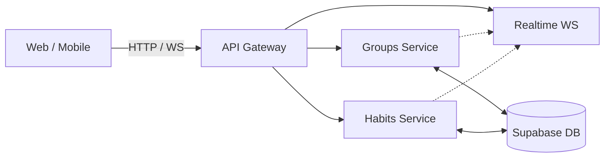

# Dydi

**La plataforma de accountability social donde grupos de amigos rastrean hábitos diarios y gamifican las consecuencias.**

Dydi no es un tracker individual. Es una experiencia de grupo en tiempo real donde fallar en tus rutinas implica enfrentarte a la ruleta semanal de penitencias elegidas por tus propios amigos.

---

## 🎯 Qué es Dydi

En Dydi, el compromiso es público (para tu squad):
1. **Crear squad e invitar:** Un usuario funda un grupo y trae a sus amigos (máx. 8).
2. **Proponer y votar:** En equipo, proponen qué hábitos quieren rastrear (ej. "30 min de código", "leer 20 páginas").
3. **Check-ins diarios:** Cada miembro reporta su cumplimiento; el progreso se sincroniza al instante en las pantallas de todos.
4. **Consecuencias (La Ruleta):** Quien falla durante la semana entra al sorteo del sábado. El grupo vota un castigo y la ruleta decide el resultado final.

---

## 📸 Evidencia Visual

*(Las capturas se encuentran disponibles en la carpeta [`docs/screenshots/`](docs/screenshots/README.md). Se incluirán visualizaciones reales en cuanto el ambiente despliegue con datos de prueba).*

---

## 🛠 Stack Tecnológico

Dydi es un monorepositorio con despliegue en contenedores:

- **Frontend Web:** Vue 3, Vite, TailwindCSS (Responsive, optimizado para interacciones rápidas).
- **Mobile App:** Expo / React Native (Compartiendo los mismos endpoints y flujos).
- **Backend / Microservicios:** Go 1.24 con `chi v5`.
- **Tiempo Real:** WebSockets (Hub centralizado en Go).
- **Base de Datos & Auth:** Supabase (PostgreSQL + JWT OAuth).
- **Infraestructura Local:** Docker Compose.

---

## 🏗 Arquitectura

Dydi utiliza un enfoque de microservicios, diseñado académicamente para explorar patrones de enrutamiento y concurrencia.


> 👉 [Lee la documentación detallada de Arquitectura y Trade-offs](docs/architecture.md).

### Decisiones Técnicas Destacadas

* **API Gateway & Límites:** Un solo punto de entrada que expone los recursos unificados. Los servicios Go operan de forma aislada y se especializan por dominio.
* **Seguridad sin latencia:** El API Gateway verifica el JWT usando JWKS de Supabase. Luego inyecta un `INTERNAL_TOKEN` en las llamadas proxeada. Los microservicios confían ciegamente en este token, ahorrando validaciones costosas.
* **Tiempo Real Efectivo:** El servicio `realtime` maneja un pool de WebSockets puro en Go. Cuando `habits-service` guarda un check-in, le notifica internamente al hub para hacer el broadcast al instante.
* **Docker First:** Ningún desarrollador necesita instalar Go o Node. El flujo entero de `docker-compose.yml` monta los volúmenes, logrando un hot-reload idéntico en cualquier OS.

---

## 🧪 Calidad y Verificación

Dydi usa una suite de integración robusta que espeja el CI: el script `verify.sh`. Todo corre en contenedores efímeros sin depender de entornos locales ensuciados.

Al correr `./verify.sh`, Dydi ejecuta:
- **Go:** `gofmt`, `go vet`, `golangci-lint` (linter estricto), `go build`, y `go test -race` (detector de condiciones de carrera).
- **Frontend:** `eslint`, format check, `npm test` y el build de producción.
- **Mobile:** Typecheck estricto con `tsc --noEmit`.

Los PRs no se aprueban si estas pruebas fallan.

---

## 🚀 Instalación Local

Solo necesitas Docker y credenciales de Supabase (las cuales debes solicitar al equipo, o crear tu propio proyecto en Supabase).

1. **Clonar y configurar**
   ```bash
   git clone <url> && cd dydi
   cp .env.example .env
   # Llena el .env con las URLs de tu Supabase y un INTERNAL_TOKEN aleatorio
   ```

2. **Levantar los servicios**
   ```bash
   docker compose up --build
   ```

3. **Acceder**
   * Frontend: http://localhost:5173
   * API Gateway: http://localhost:8080

> Consulta la [Guía de Contribución](CONTRIBUTING.md) para más comandos, scripts de atajo y detalles del flujo de Git.

---

## 📂 Estructura del Repositorio

```text
dydi/
├── api-gateway/       # Entrada única, validador de JWT
├── groups-service/    # Lógica de squads y membresías
├── habits-service/    # Check-ins, rachas y ruleta
├── realtime-service/  # Hub WebSocket
├── frontend/          # Vue 3 SPA
├── mobile/            # React Native app (Expo)
├── docs/              # Arquitectura e imágenes
├── supabase/          # Migraciones y esquema BD
├── scripts/           # Herramientas dev (hits directos, logs)
└── verify.sh          # Suite de validación total CI
```

## 🛡 Garantías de Confiabilidad y Red

Dydi implementa estrategias específicas para operar de forma resiliente en infraestructuras gratuitas (como Render Free Tier):

### Política de Reintentos (Mobile)
- Las operaciones de lectura (`GET`, `HEAD`, `OPTIONS`) se reintentan automáticamente (hasta 3 veces) ante errores transitorios o errores de servidor (502, 503, 504), mitigando fallos por cold starts.
- Las operaciones con efectos secundarios (`POST`, `PUT`, `PATCH`, `DELETE`) **no se reintentan automáticamente**. Esto previene la duplicación accidental de penalizaciones o grupos creados en caso de que el backend haya completado la solicitud pero la respuesta se haya perdido por un fallo de red transitorio.

### Mantenimiento de Actividad (Wake-Up)
Para evitar los periodos de inactividad de 15 minutos en Render, Dydi cuenta con un modelo de Wake-Up centralizado:
- `GET /health` en el API Gateway sirve estrictamente como "liveness check" y no interactúa con ningún otro servicio de backend.
- `POST /ops/wake` es un endpoint protegido por un secreto (`X-Wake-Token`) que despierta todos los microservicios en segundo plano.
- **Configuración del Cron:** El cronjob externo debe enviar una petición `POST` a `/ops/wake` con el header `X-Wake-Token: <WAKE_TOKEN>`.
> **Nota para el despliegue:** Proveedores como la herramienta de cron interna de Render solo soportan peticiones `GET` sin headers. Para llamar a `/ops/wake`, debes usar un servicio externo compatible con `POST` y headers personalizados (por ejemplo, [cron-job.org](https://cron-job.org/) o un Github Actions workflow).

---

## ⚠️ Estado y Limitaciones

* Dydi es un proyecto académico UTD (2026).
* Al ser la versión Free-Tier en Render, los microservicios duermen a los 15 min de inactividad, lo que produce un cold start notorio en el primer request.
* Actualmente no se permiten adjuntos de fotos como evidencia de hábitos (es basado en confianza social o reportes).

---

© 2026 DYDI · UTD Integradora
